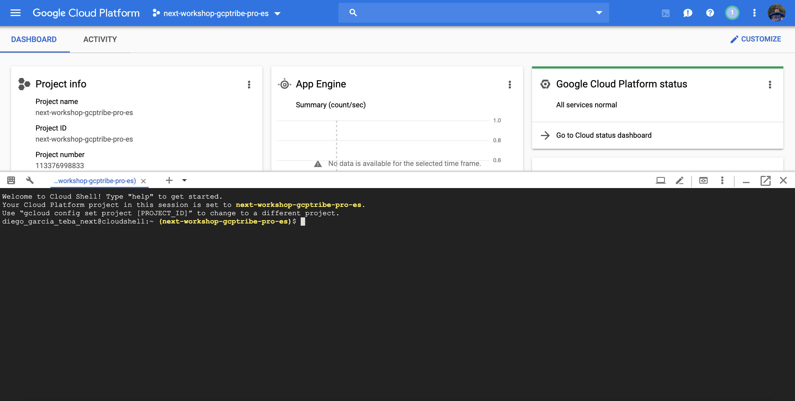

# Playing with managed services on GCP

## Prerrequisitos

### Herramientas y frameworks de desarrollo

**Opcional:** Únicamente sería necesario realizar este paso si no se trabaja desde Cloud Shell.

Hemos de instalar las siguientes herramientas.

* [Google Cloud SDK](https://cloud.google.com/sdk/install)
* [Node.js](https://nodejs.org/en/download/)

### Variables de entorno

Hemos de establecer las siguientes variables de entorno.

```bash
export PROJECT_ID=<project_id>
export BUCKET_NAME=<bucket_name>
export GCP_REGION=<region>
```

Aquí se puede consultar la [lista de regiones](https://cloud.google.com/storage/docs/locations#available_locations) disponibles.

### Proyecto en Google Cloud

Para poder realizar este workshop, necesitaremos disponer de un proyecto de Google Cloud. Este nos será facilitado al comienzo del mismo.

Una vez que tengamos acceso a este, lo primero que haremos será habilitar las APIs de Google con las que vamos a trabajar.

Para ello, lo podremos hacer tanto con `gcloud` como desde la consola de Google Cloud.

#### GCloud

Para realizar la activación de las API's con GCloud, introduciremos el siguiente código en Cloud Shell.

```bash
    gcloud services enable cloudfunctions.googleapis.com \
        vision.googleapis.com \
        pubsub.googleapis.com \
        appengine.googleapis.com \
        firestore.googleapis.com \
        storage-component.googleapis.com \
        storage-api.googleapis.com
```

#### Consola

Para realizar lo mismo desde la consola de GCP, iremos a "APIs & Services -> Dashboard" dentro de nuestro proyecto Google Cloud. Una vez aquí habilitaremos (si es que ya no lo están) las siguientes APIs.
 * Cloud Functions API
 * Cloud Vision API
 * Cloud Pub/Sub API
 * App Engine Admin API
 * Cloud Firestore API
 * Cloud Storage
 * Google Cloud Storage JSON API

## Cloud Shell

Para la realización de este workshop, vamos a trabajar haciendo uso de [Cloud Shell](https://cloud.google.com/shell/).

Cloud Shell nos permitirá trabajar en un entorno cloud en el cual tendremos todas las herramientas necesarias ya configuradas y listas para su uso.

Para acceder a Cloud Shell desde la consola de GCP, una vez que estemos en nuestro proyecto asignado para el workshop, iremos a la parte superior derecha y haremos click sobre el icono de Cloud Shell, tal y como se muestra en a imagen.


Una vez hecho esto, se nos abrirá nuestra terminal en la cloud.



## Descargar código fuente

El código fuente del workshop se encuentr alojado en Github, en el siguiente repositorio.

```bash
https://github.com/beeva/NEXT-WORKSHOP-GCPTRIBE
```

Para poder acceder al mismo, hemos de hacerlo con nuestro usuario de Github de BBVA Next (next-xxx).

Desde Cloud Shell, clonaremos el repositorio de código para empezar a trabajar con el.

```bash
git clone git@github.com:beeva/NEXT-WORKSHOP-GCPTRIBE.git
```

## Configurando los diferentes productos gestionados

### 1. Google Cloud Storage

Para alojar las imágenes que se van a usar en la aplicación de demo, vamos a crear un bucket de Google Cloud Storage en el cual iremos almacenando estas.

Para ello, desde Cloud Shell, ejecutaremos el siguiente comando.

```bash
gsutil mb -c regional -l $GCP_REGION -p $PROJECT_ID gs://$BUCKET_NAME
```

Este bucket será usado en los pasos posteriores.

### 2. Google Cloud Fuctions

Para procesar las imágenes que se suben a la aplicación, vamos a generar una [Cloud Function](https://cloud.google.com/functions/). Esta función será la encargada de invocar al [API de Vision](https://cloud.google.com/vision/docs/) de Google, analizar la imagen detectando las entidades que en ella se encuentran y almacenar dicha información en [Firebase Database](https://firebase.google.com/docs/database) ([Cloud Firestore](https://cloud.google.com/firestore/docs/)).

 1. Para crear la función, iremos hasta [Cloud Functions](https://console.cloud.google.com/functions) dentro de nuestro proyecto en GCP.
 2. Una vez aquí, pulsaremos sobre "Create Function", ubicado en la parte superior.
 3. A continuación, introduciremos la siguiente información.
    1. Name: Nombre de la función a crear.
    2. Trigger: Cloud Storage
    3. Event type: Finalize/Create
    4. Bucket: Seleccionaremos el bucket que hemos creado previamente.
    5. Source code: Inline editor
    6. Runtime: Node.js 8
    7. Completar el código fuente usando los ficheros [index.js](image-analyzer-cf/index.js) y [package.json](image-analyzer-cf/package.json).
    8. Function to execute: AnalyzeImage
4. Una vez introducida esta información, pulsaremos sobre "Create" para proceder a la creación de la función.
5. Una vez que Google nos avise de que esta ha sido creada, ya estará disponible para empezar a recibir peticiones cada vez que se inserte una nueva imagen en nuestro bucket de Firebase Storage (Cloud Storage).

### 3. Google Vision API

Para este workshop, haremos uso de la funcionalidad de [detección de etiquetas](https://cloud.google.com/vision/docs/labels) sobre imágenes, para poder categorizarlas de forma automática.

Dentro del fichero [index.js](image-analyzer-cf/index.js) de nuestra función podremos ver el código fuente necesario para invocar a este API. Comentar también que necesitaremos incluir la dependencia necesaria para poder hacer uso de la librería de visión en el fichero [package.json](image-analyzer-cf/package.json).

### 4. Firebase Database (Cloud Firestore) y Firebase Storage (Cloud Storage)

A continuación, veremos como integrar Firebase (Database y Storage) con nuestro proyecto de demo, para comunicar de manera sencilla distintos servicios de almacenamiento o base de datos que ya hemos usado antes. Además, bucearemos en la documentación de la API, para interactuar con Firebase Storage (Cloud Storage) y Firebase Database (Cloud Firestore).

 1. Obtener la rama `feature/images-drawer-upload-image-step` desde Cloud Shell.
 ```bash
 git checkout feature/images-drawer-upload-image-step
 ```
 2. Acceder a la [consola](https://console.firebase.google.com) de Firebase
 3. Una vez aquí, crearemos nuestro proyecto Firebase, pulsando sobre "Añadir proyecto", completando la siguiente información.
    1. Project name: seleccionaremos del desplegable el proyecto GCP que nos ha sido asignado para la realización de este workshop.
    2. Marcaremos los dos check box para hacer uso de la configuración por defecto de Google Analytics para Firebase y aceptar los terminos y condiciones del servio.
    3. Por último pulsaremos sobre "Add Firebase" lo que hará que se nos genere nuestro proyecto Firebase.
    4. Si nos pide confirmación del plan de precios a usar, seleccionaremos "Pay as you go" (Blaze).
 4. Una vez que ya tenemos el proyecto creado, hemos de registrar nuestra aplicación. Para ello, desde la página principal de nuestro proyecto de Firebase, pulsaremos sobre "Add an app to get started", en concreto usaremos la aplicación web (simbolo </>).
    1. Daremos un nombre a nuestra aplicación ("Demo App" por ejemplo)
    2. No seleccionaremos el check box de Firebase Hosting, ya que nuestra app será desplegada en App Engine.
    3. Por ultimo, compiaremos la configuración del SDK de Firebase que se nos muestra para nuestra aplicación en el fichero images-drawer-react/src/firebase/index.js que hemos descargado del repositorio de código, completando el parámetro `storageBucket` con el nombre que dimos a nuestro bucket cuando lo definimos en la variable de entorno `GCP_BUCKET`.
 5. Habilitar Firebase Storage.
    1. Pulsamos sobre Storage en el menú lateral de la consola de Firebase.
    2. Pulsamos sobre "Get Started" para comenzar la configuración.
    3. Pulsamos sobre "Next", dejando la configuración por defecto.
    4. Seleccionamos la región para nuestros datos (para este workshop da igual la que seleccionemos) y pulsamos sobre "Done".
    5. A continuación, añadimos nuestro bucket que creamos en el punto 1 en lugar de usar el bucket por defecto. Para ello pulsamos sobre el incono de los tres puntos, seleccionando la opción "Add bucket".
    6. Importamos nuestro bucket que ya tenemos creado, seleccionandolo en la lista ofrecida y pulsamos sobre "Continue".
    7. Pulsamos sobre "Got it" para salir.
    8. Pulsamos en la opción de "Rules" en la parte superior, seleccionado el bucket que acabamos de añadir.
    9. Cambiamos el valor `false` existente por `true` para poder leer y escribir en el bucket y pulsamos sobre "Publish".
 6. Habilitar Firebase Database.
    1. Pulsamos sobre Database en el menú lateral de la consola de Firebase.
    2. Pulsamos sobre "Create database" para comenzar la configuración.
    3. Seleccionamos "Start in test mode" para permitir tanto lectura como escritura de forma rápida y pulsamos "Next" para continuar.
    4. Pulsamos "Done" para finalizar.
 7. Completar código images-drawer-react/src/components/ImageUpload.jsx, usando el método put, para subir la imágen al bucket. Documentación de referencia de subida de objetos a [Firebase Storage](https://firebase.google.com/docs/storage/web/upload-files?hl=es-419).
 8. Comprobar el resultado con rama `feature/images-drawer-gallery-step`.
 9. (Opcional). Usando el componente react-grid-gallery y firebase, listar las imágenes con sus etiquetas. El resultado de este paso está disponible en la rama `feature/images-drawer-final-step`.

 ### 5. Google App Engine

A través de estos pasos, crearemos y configuraremos nuestra aplicación demo en App Engine:

 1. Una vez clonado el código fuente de nuestra aplicación de demo en el paso anterior, nos situaremos en la carpeta `images-drawer-react`.
 2. Esta apliación de ejemplo ha sido creada en base al esqueleto obtenido desde la web de [React](https://es.reactjs.org/docs/create-a-new-react-app.html).
 3. Podemos ir desplegando los distintos pasos ubicados en las distintas ramas. Para ello, siempre ejecutar los comandos desde la carpeta `images-drawer-react`.
 4. Para descargar las dependencias, ejecutar `npm install`.
 5. Para ejecutar en local, ejecutar `npm start`
 6. Podemos ver la aplicación ejecutandose en local desde Cloud Shell haciendo uso de la funcionalidad de vista previa que Cloud Shell proporciona. Para ello, hacer click en la parte superior derecha en el icono de vista previa, haciendo uso del puerto 3000.
 7. Crear fichero de configuración [app.yaml](https://cloud.google.com/appengine/docs/standard/nodejs/config/appref) para Node.js y App Engine Standard. Este fichero debe de estar ubicado dentro de la carpteta `images-drawer-react`.
 8. Por último, podemos desplegar la aplicación con el siguiente comando `gcloud app deploy --project=$PROJECT_ID --version=1-0-0`.